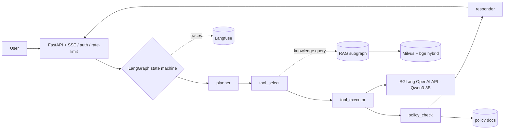

# PolicyArena

**A production-style, policy-compliant tool-calling + RAG agent platform.**
Qwen3 · SGLang · LangGraph · LlamaIndex + Milvus · FastAPI · Langfuse · LoRA/QLoRA — with a
statistics-first evaluation harness (τ²-bench, BFCL-V4, TruLens RAG-triad, bootstrap CIs, pass^k).

> Status: **scaffold (Phase 0 complete)**. All result numbers below are `TBD` and are filled
> **only from real runs** — this project never fabricates metrics.

---

## What it is

PolicyArena is an agent that selects and calls tools to resolve enterprise service-desk
requests, **while respecting written policy**. An answer that violates a policy (e.g. issuing a
refund past the allowed window) is scored as a **FAILURE**, not a stylistic nit. It covers two
domains:

1. **Standardized eval** on τ²-bench (retail / knowledge) + BFCL-V4.
2. **A self-built Chinese "企业服务台" (enterprise service desk)** domain — policy docs
   (refund / modify / SLA), five tools (`query_order`, `modify_order`, `refund`,
   `create_ticket`, `search_kb`), and a small FAQ knowledge base. The Chinese domain is trained
   on **real Chinese tool-calling trajectories**, not English-with-augmentation.

## Architecture



## Hardware & CUDA (Blackwell)

Target cards are **RTX 5090 (32 GB)** and **RTX PRO 6000 (96 GB)** — both Blackwell, compute
capability **sm_120**, so **CUDA 12.8+ is required**.

| Card | Training default | Serving default | GRPO |
| --- | --- | --- | --- |
| RTX 5090 (32 GB) | QLoRA (4-bit) | AWQ / FP8 | out of scope (won't fit) |
| RTX PRO 6000 (96 GB) | LoRA + bf16 | bf16 / FP8 | feasible (STRETCH) |

**Default build profile for this repo: RTX PRO 6000 (96 GB)** — bf16 LoRA-SFT + bf16 serving
(FP8 as a throughput ablation); GRPO is in scope as a STRETCH single-card run. The 5090 fallback
profile (QLoRA + FP8) is preserved in `configs/`.

- Pin **cu128** torch wheels: `pip install torch torchvision --index-url https://download.pytorch.org/whl/cu128`,
  then verify `python -c "import torch; print(torch.cuda.get_arch_list())"` contains `sm_120`.
- **Do not** use cu124/cu126 wheels on Blackwell — they only compile up to sm_90 and fail at
  runtime with `no kernel image is available for execution on the device`.
- Serve via the prebuilt **`lmsysorg/sglang:blackwell`** image (AOT sm_120 kernels) with
  `--attention-backend flashinfer`. Do **not** build flash-attn from source.

## Tech stack

| Layer | Choice |
| --- | --- |
| Model | `Qwen/Qwen3-8B` (CORE), `Qwen/Qwen3-4B` (edge ablation), `Qwen3.5-9B` (STRETCH compare) |
| Serving | **SGLang** (OpenAI-compatible) · vLLM (alt) · Ollama (dev fallback) |
| Orchestration | LangGraph (stateful + checkpointing) · Qwen-Agent tool-calling |
| RAG | LlamaIndex + Milvus + bge-m3 / bge-reranker-v2 + hybrid (BM25 + dense) |
| Backend | FastAPI + uv + SSE + auth + rate limit |
| Frontend | Gradio / Streamlit (CORE) · Next.js (STRETCH) |
| Observability | Langfuse (self-host) · Prometheus + Grafana (STRETCH) |
| Fine-tuning | PEFT (LoRA/QLoRA) + TRL · GRPO (STRETCH) |
| Eval | τ²-bench · BFCL-V4 · TruLens RAG-triad · bootstrap / pass^k / Holm–Bonferroni |
| Deploy | Docker Compose (CORE) · K8s/Helm (STRETCH) · GitHub Actions (deterministic eval gate) |

## Repo layout

```
policyarena/
├── README.md  docker-compose.yml  pyproject.toml  .env.example  LICENSE
├── agent/      graph.py  state.py  nodes/  tools/  policies/
├── rag/        ingest.py  index.py  retrieve.py  rerank.py
├── serving/    sglang_server.sh  vllm_server.sh  litellm_config.yaml
├── api/        main.py  auth.py  ratelimit.py
├── frontend/
├── finetune/   build_sft_data.py  train_lora.py  train_grpo.py
├── eval/       run_tau2.py  run_bfcl.py  bootstrap.py  passk.py  rag_triad.py
├── observability/
├── configs/    model.yaml  lora.yaml  retrieval.yaml  server.yaml  eval.yaml
├── requirements/   rag.txt  train.txt  eval.txt   # heavy / CUDA stacks (GPU box)
├── tests/
├── report/     technical_report.md  one_pager.md
└── .github/workflows/ci.yml
```

## Quick start (off-GPU)

```bash
uv sync                 # create .venv and install the light runtime + dev tools
uv run ruff check .     # lint
uv run pytest           # smoke tests
cp .env.example .env    # then edit .env (never commit it)
```

**Dependency layout.** The light, GPU-free runtime (the agent graph, API, eval statistics) lives
in `pyproject.toml` so `uv sync` is fast and reproducible anywhere. Heavy / CUDA-pinned stacks
(`torch` cu128, transformers/peft/trl, llama-index, embeddings, Milvus client) live in
`requirements/*.txt` and are installed on the Blackwell box per phase. Serving engines run from
Docker (`lmsysorg/sglang:blackwell`), not pip.

## Configuration

All knobs are YAML under `configs/` (`model`, `lora`, `retrieval`, `server`, `eval`) — no magic
constants in code. Secrets come from `.env` via `os.environ` only; never hardcoded. Frontends keep
state in app/server memory (no browser `localStorage`/`sessionStorage`).

## Results (TBD until real runs)

All numbers are filled from real runs only and reported with **95% bootstrap CIs (≥10k resamples)**.
Latency is measured on an **exclusive (non-time-sliced) GPU**.

| Track | Benchmark / Metric | Base Qwen3-8B | + LoRA-SFT | Notes |
| --- | --- | --- | --- | --- |
| Tool-calling | τ²-bench retail · pass^1 | TBD | TBD | combinatorial pass^k |
| Tool-calling | τ²-bench retail · pass^4 | TBD | TBD | E[C(c,k)/C(n,k)] |
| Tool-calling | BFCL-V4 · AST accuracy | TBD | TBD | record V4 version |
| Service-desk (zh) | tool accuracy | TBD | TBD | self-built domain |
| Service-desk (zh) | policy-violation rate ↓ | TBD | TBD | any violation = FAILURE |
| Service-desk (zh) | schema-valid rate | TBD | TBD | JSON-schema validator |
| RAG | groundedness (TruLens) | TBD | TBD | RAG triad |
| RAG | context / answer relevance | TBD | TBD | RAG triad |
| Serving | p50 / p95 latency | TBD | TBD | exclusive GPU only |

## Roadmap

- [x] **Phase 0** — Scaffold (repo skeleton, uv, configs, tests, CI)
- [ ] **Phase 1** — Serving + base model online (SGLang; Ollama dev fallback)
- [ ] **Phase 2** — LangGraph agent + 5 tools + policy check + FastAPI + demo UI
- [ ] **Phase 3** — RAG subgraph (ingest / index / hybrid retrieve / rerank, with citations)
- [ ] **Phase 4** — Observability (Langfuse tracing + prompt versioning)
- [ ] **Phase 5** — Eval harness + statistics (τ²-bench, BFCL-V4, RAG-triad, bootstrap, pass^k)
- [ ] **Phase 6** — CI/CD deterministic eval gate
- [ ] **Phase 7** — Fine-tuning (LoRA/QLoRA-SFT CORE; GRPO STRETCH — feasible on the PRO 6000)
- [ ] **Phase 8** — Deploy (`docker compose up`) + technical report

CORE items ship first; STRETCH items are attempted only after CORE works and with the owner's
go-ahead.

## License

[MIT](LICENSE).
