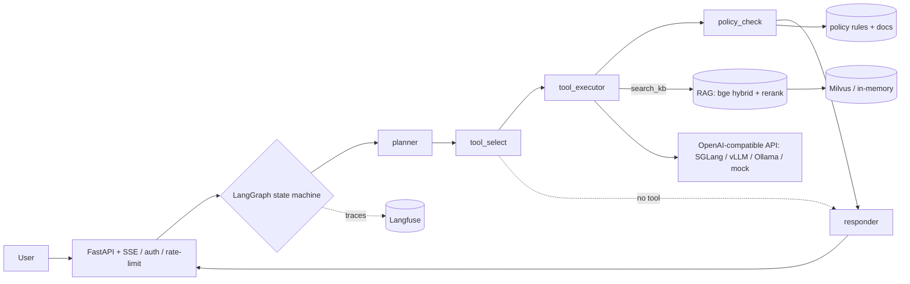

# PolicyArena

**A production-style, policy-compliant tool-calling + RAG agent platform.**
Qwen3 · SGLang · LangGraph · LlamaIndex/Milvus · FastAPI · Langfuse · LoRA/QLoRA — with a
statistics-first evaluation harness (τ²-bench, BFCL-V4, TruLens RAG-triad, bootstrap CIs, pass^k).

> **Status.** The full system is implemented and runs **off-GPU today** (deterministic dev
> backend): agent graph, 5 tools + policy checks, hybrid RAG, FastAPI + SSE, Gradio UI,
> tracing, eval harness, deterministic CI gate, SFT data builder, LoRA dry-run. The
> **on-GPU steps** (live SGLang serving, real τ²-bench/BFCL numbers, the actual LoRA/GRPO
> training runs) are coded as runnable scripts and executed on the Blackwell box — their
> metrics stay **`TBD`** here. **No fabricated numbers, ever.**

---

## What it is

An agent that selects and calls tools to resolve enterprise service-desk requests **while
respecting written policy**. An answer that violates a policy (e.g. refunding past the
window) is scored as a **FAILURE**, not a style nit. Two domains:

1. **Standardized eval** — τ²-bench (retail/knowledge) + BFCL-V4.
2. **A self-built Chinese “企业服务台” (enterprise service desk)** — policy docs (refund /
   modify / SLA), five tools (`query_order`, `modify_order`, `refund`, `create_ticket`,
   `search_kb`), and a small FAQ KB. Trained on **real Chinese tool-calling trajectories**
   (not English-with-augmentation).

## Architecture



The same graph runs against **SGLang/vLLM/Ollama** (by `base_url`) or a deterministic
**mock** backend so the whole thing is demonstrable and testable without a GPU.

## Repo layout

```
.
├── agent/        graph.py state.py  nodes/{planner,tool_select,tool_executor,policy_check,responder}
│                 tools/{schemas,registry,services}  policies/{rules, policy_docs/*.zh.md}
├── rag/          text.py embeddings.py ingest.py index.py retrieve.py rerank.py pipeline.py  sample_kb/*.md
├── serving/      client.py  sglang_server.sh  vllm_server.sh  litellm_config.yaml
├── api/          main.py  auth.py  ratelimit.py
├── frontend/     app.py            (Gradio chat UI)
├── finetune/     build_sft_data.py  train_lora.py  train_grpo.py
├── eval/         metrics.py harness.py tasks.py stats.py report.py gate.py
│                 passk.py bootstrap.py run_tau2.py run_bfcl.py rag_triad.py
├── observability/ tracing.py  prompts.py
├── common/       config.py         (env Settings + typed YAML loaders)
├── configs/      model.yaml lora.yaml retrieval.yaml server.yaml eval.yaml
├── requirements/ train.txt rag.txt eval.txt   (heavy / CUDA stacks for the GPU box)
├── tests/        (100 tests)
├── report/       technical_report.md  one_pager.md
├── docker-compose.yml  pyproject.toml  .env.example  .github/workflows/ci.yml
```

## Hardware & CUDA (Blackwell)

Target cards: **RTX 5090 (32 GB)** and **RTX PRO 6000 (96 GB)** — both Blackwell, compute
capability **sm_120**, so **CUDA 12.8+** is required.

| Card | Training default | Serving default | GRPO |
| --- | --- | --- | --- |
| RTX 5090 (32 GB) | QLoRA (4-bit) | AWQ / FP8 | out of scope (won't fit) |
| RTX PRO 6000 (96 GB) | **LoRA + bf16** | **bf16** / FP8 | feasible (STRETCH) |

**Default build profile for this repo: RTX PRO 6000 (96 GB)** — bf16 LoRA-SFT + bf16 serving
(FP8 as a throughput ablation); GRPO is in scope as a STRETCH single-card run. The 5090
fallback (QLoRA + FP8) is preserved in `configs/`.

- **Do not** use cu124/cu126 wheels on Blackwell — they only compile to sm_90 and fail with
  `no kernel image is available for execution on the device`.
- Serve via the prebuilt **`lmsysorg/sglang:blackwell`** image with `--attention-backend flashinfer`.

---

# Installation

### Prerequisites
- **uv** (Python package/dep manager) and **Python 3.11**. Install uv:
  ```bash
  curl -LsSf https://astral.sh/uv/install.sh | sh      # or: pipx install uv
  ```
- **Docker** (for serving, Milvus, Langfuse, and the full stack).
- A **Blackwell GPU + NVIDIA Container Toolkit** for the on-GPU steps only.

### A) Off-GPU dev (everything except live serving / training / real evals)
```bash
git clone https://github.com/IntheFesh/project1.git policyarena && cd policyarena
uv sync                       # create .venv + install the light, GPU-free runtime + dev tools
uv sync --extra ui            # add the Gradio demo UI  (optional)
uv sync --extra obs           # add Langfuse client      (optional)
cp .env.example .env          # then edit .env (never commit it)
```

### B) Blackwell GPU box (adds the CUDA stacks; NOT in the uv lock)
```bash
# 1) torch MUST come from the CUDA 12.8 index (cu124/cu126 will fail on sm_120):
uv pip install torch torchvision --index-url https://download.pytorch.org/whl/cu128
python -c "import torch; print(torch.cuda.get_arch_list())"   # must contain 'sm_120'

# 2) training + RAG + external-eval deps:
uv pip install -r requirements/train.txt    # transformers, peft, trl, bitsandbytes, ...
uv pip install -r requirements/rag.txt       # llama-index, pymilvus, FlagEmbedding (bge), ...
uv pip install -r requirements/eval.txt      # trulens-eval; tau2-bench / BFCL per their READMEs
```

### `.env`
All secrets come from the environment (never hardcoded). Key entries (see `.env.example`):
`SERVING_BACKEND` (`sglang|vllm|ollama|mock`), `OPENAI_BASE_URL`, `MODEL_ID`, `API_AUTH_TOKEN`,
`MILVUS_URI`, `LANGFUSE_*`, `RATE_LIMIT_PER_MINUTE`.

---

# Running

## 1. Sanity checks (off-GPU, no setup beyond `uv sync`)
```bash
uv run ruff check .            # lint
uv run pytest                  # 100 tests
uv run python -m eval.gate     # deterministic CI eval gate (prints PASS + metrics)
```

## 2. Off-GPU demo with the deterministic mock backend
`SERVING_BACKEND=mock` swaps in a rule-based stand-in (NOT a model) so you can drive the full
agent without a GPU.

**API (FastAPI + SSE):**
```bash
SERVING_BACKEND=mock API_AUTH_TOKEN=dev-token \
  uv run uvicorn api.main:app --host 127.0.0.1 --port 8000
```
```bash
curl -s localhost:8000/health
# policy-blocked refund (order is 30 days old -> refused, with the violation):
curl -s -X POST localhost:8000/agent/query \
  -H "Authorization: Bearer dev-token" -H "Content-Type: application/json" \
  -d '{"message":"订单 A1009 我要退款"}'
# grounded, cited knowledge answer:
curl -s -X POST localhost:8000/agent/query \
  -H "Authorization: Bearer dev-token" -H "Content-Type: application/json" \
  -d '{"message":"请问运费是怎么计算的？"}'
# SSE stream of plan -> tool -> result -> final:
curl -N -X POST localhost:8000/agent/stream \
  -H "Authorization: Bearer dev-token" -H "Content-Type: application/json" \
  -d '{"message":"查询订单 A1001 的状态"}'
```

**Gradio UI** (shows the live tool call + policy trace; state in server memory, no browser storage):
```bash
SERVING_BACKEND=mock uv run python frontend/app.py     # http://localhost:7860
```

## 3. Serve the real model (Blackwell GPU box)
```bash
# SGLang (PRIMARY) via the Blackwell image — OpenAI-compatible on :30000
bash serving/sglang_server.sh
# verify a tool call + forced tool_choice (xgrammar):
curl -s localhost:30000/v1/chat/completions -H "Content-Type: application/json" -d '{
  "model":"Qwen/Qwen3-8B",
  "messages":[{"role":"user","content":"查询订单 A1001 的状态"}],
  "tools":[{"type":"function","function":{"name":"query_order",
    "parameters":{"type":"object","properties":{"order_id":{"type":"string"}},"required":["order_id"]}}}],
  "tool_choice":"required"}'
```
Alternatives: `bash serving/vllm_server.sh` (vLLM), or Ollama for local dev:
```bash
ollama serve & ollama pull qwen3:8b      # then point the app at it:
SERVING_BACKEND=ollama uv run uvicorn api.main:app --port 8000
```
Point the app at SGLang: set `SERVING_BACKEND=sglang` and `OPENAI_BASE_URL=http://localhost:30000/v1` in `.env`.

## 4. Fine-tuning
```bash
uv run python -m finetune.build_sft_data --out outputs/sft/zh_service_desk.jsonl  # off-GPU
uv run python -m finetune.train_lora --dry-run                                    # off-GPU: validate config + data
uv run python -m finetune.train_lora                                              # GPU box (needs requirements/train.txt)
# GRPO is STRETCH (PRO 6000 only) — ask before running.
```

## 5. Evaluation
```bash
# off-GPU pipeline smoke (NOT a benchmark; validates the harness):
uv run python -c "from eval.run_tau2 import smoke; from serving.client import ScriptedLLMClient; print(smoke(ScriptedLLMClient()).model_dump())"
# real benchmarks run on the GPU box against the served model:
#   eval/run_tau2.run(...)  -> τ²-bench retail/knowledge   (github.com/sierra-research/tau2-bench)
#   eval/run_bfcl.run(...)  -> BFCL-V4 AST accuracy         (record the exact V4 version)
# headline numbers use bootstrap 95% CIs (eval/bootstrap.py) + pass^k (eval/passk.py) +
# paired bootstrap / Holm-Bonferroni (eval/stats.py). Latency p50/p95 on an EXCLUSIVE GPU.
```

## 6. Observability (Langfuse) & full stack
```bash
uv sync --extra obs           # then set LANGFUSE_* in .env; each turn is traced
docker compose up             # sglang + milvus(+etcd/minio) + langfuse(+postgres)
                              # agent-api / frontend join once their Dockerfiles land (Phase 8)
```

---

## Configuration
All knobs are YAML under `configs/` (`model`, `lora`, `retrieval`, `server`, `eval`) — no magic
constants. `common/config.py` loads them (with `${ENV}` expansion) and exposes typed models +
an env-driven `Settings`. Secrets via `os.environ`/`.env` only.

## Dependency layout
The light, GPU-free runtime (agent graph, API, RAG-dev, eval statistics) lives in
`pyproject.toml` so `uv sync` is fast and reproducible anywhere. Heavy / CUDA-pinned stacks
(`torch` cu128, transformers/peft/trl, llama-index, bge embeddings, Milvus client, TruLens)
live in `requirements/*.txt` and install on the Blackwell box per step. Serving engines run
from Docker (`lmsysorg/sglang:blackwell`), not pip. Optional pyproject extras: `ui`, `obs`, `eval`.

## CORE vs STRETCH
Everything above is **CORE** and implemented. **STRETCH** items are deferred and started only
on request: LiteLLM gateway, GRPO training run, Next.js frontend, Prometheus+Grafana, K8s/Helm,
and a Qwen3.5-9B comparison (gated behind a smoke test).

## Results (TBD until real runs)
Filled from real runs only, reported with **95% bootstrap CIs (≥10k resamples)**; latency on an
**exclusive (non-time-sliced) GPU**. (Off-GPU smoke runs validate the *pipeline*, not quality.)

| Track | Benchmark / Metric | Base Qwen3-8B | + LoRA-SFT | Notes |
| --- | --- | --- | --- | --- |
| Tool-calling | τ²-bench retail · pass^1 | TBD | TBD | combinatorial pass^k |
| Tool-calling | τ²-bench retail · pass^4 | TBD | TBD | E[C(c,k)/C(n,k)] |
| Tool-calling | BFCL-V4 · AST accuracy | TBD | TBD | record V4 version |
| Service-desk (zh) | tool accuracy | TBD | TBD | self-built domain |
| Service-desk (zh) | policy-violation rate ↓ | TBD | TBD | any violation = FAILURE |
| Service-desk (zh) | schema-valid rate | TBD | TBD | JSON-schema validator |
| RAG | groundedness (TruLens) | TBD | TBD | RAG triad |
| Serving | p50 / p95 latency | TBD | TBD | exclusive GPU only |

## Roadmap
- [x] **Phase 0** — Scaffold (repo, uv, configs, tests, CI)
- [x] **Phase 1** — Serving client (SGLang/vLLM/Ollama by base_url) + mock fallback *(live SGLang launch: GPU box)*
- [x] **Phase 2** — LangGraph agent + 5 tools + policy check + FastAPI/SSE + Gradio UI
- [x] **Phase 3** — Hybrid RAG (BM25+dense+rerank) with citations, wired into `search_kb`
- [x] **Phase 4** — Observability (Langfuse tracing + versioned prompts)
- [x] **Phase 5** — Eval harness + statistics *(real τ²-bench/BFCL numbers: GPU box)*
- [x] **Phase 6** — Deterministic CI eval gate
- [x] **Phase 7** — SFT data builder + LoRA dry-run *(actual training run: GPU box)*; GRPO STRETCH
- [ ] **Phase 8** — Deploy Dockerfiles + one-command stack + technical report (+ STRETCH scale-out)

## Testing
```bash
uv run pytest -q          # 100 tests: tools, policy, agent scenarios, RAG, API, eval, gate, SFT
uv run ruff check .       # lint
```
CI (`.github/workflows/ci.yml`): `uv sync → ruff → pytest → deterministic eval gate`.

## License
[MIT](LICENSE). No fabricated metrics; frontends keep state in app/server memory (no browser storage).
