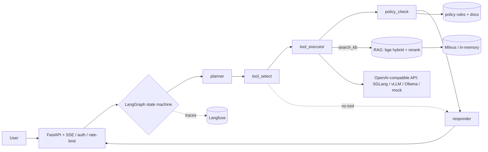

# PolicyArena

**A production-style, policy-compliant tool-calling + RAG agent platform.**
Qwen3 · SGLang · LangGraph · LlamaIndex/Milvus · FastAPI · Langfuse · LoRA/QLoRA — with a
statistics-first evaluation harness (τ²-bench, BFCL-V4, TruLens RAG-triad, bootstrap CIs, pass^k).

> **Status.** Phases 0–8 are implemented and run **off-GPU today** with a deterministic dev
> backend (100+ tests green): agent graph, 5 tools + policy checks, hybrid RAG, FastAPI + SSE,
> Gradio UI, tracing, eval harness + deterministic CI gate, SFT data builder, LoRA dry-run,
> Dockerfiles + one-command deploy. The **on-GPU steps** (live SGLang serving, real
> τ²-bench/BFCL numbers, the actual LoRA/GRPO training) are runnable scripts executed on the
> Blackwell box — their metrics stay **`TBD`** here. **No fabricated numbers, ever.**

---

## 🚀 Quickstart (one command)

```bash
# Off-GPU, no Docker — install, verify, and launch the API (deterministic mock backend):
./scripts/quickstart.sh
#   -> uv sync -> ruff -> pytest -> eval gate -> API on http://localhost:8000

# Off-GPU, with Docker — API (:8000) + Gradio UI (:7860), no GPU needed:
./scripts/deploy.sh            # == docker compose -f docker-compose.app.yml up --build

# Full stack on a Blackwell GPU box (SGLang + Milvus + Langfuse + API + UI):
cp .env.example .env && ./scripts/deploy.sh full
```

Or use `make`: `make check` (lint+test+gate) · `make demo` (API) · `make ui` · `make up` (Docker).

---

## What it is

An agent that selects and calls tools to resolve enterprise service-desk requests **while
respecting written policy**. An answer that violates a policy (e.g. refunding past the window)
is scored as a **FAILURE**, not a style nit. Two domains:

1. **Standardized eval** — τ²-bench (retail/knowledge) + BFCL-V4.
2. **A self-built Chinese “企业服务台” (enterprise service desk)** — policy docs (refund /
   modify / SLA), five tools (`query_order`, `modify_order`, `refund`, `create_ticket`,
   `search_kb`), and a small FAQ KB, trained on **real Chinese tool-calling trajectories**.

## Architecture



The same graph runs against **SGLang/vLLM/Ollama** (by `base_url`) or a deterministic **mock**
backend, so the whole system is demonstrable and testable without a GPU.

## Repo layout

```
.
├── scripts/      quickstart.sh  deploy.sh        # one-command run / deploy
├── Makefile  Dockerfile  docker-compose.yml  docker-compose.app.yml
├── agent/        graph.py state.py  nodes/  tools/{schemas,registry,services}  policies/
├── rag/          text embeddings ingest index retrieve rerank pipeline  sample_kb/*.md
├── serving/      client.py  sglang_server.sh  vllm_server.sh  litellm_config.yaml
├── api/          main.py  auth.py  ratelimit.py
├── frontend/     app.py  Dockerfile
├── finetune/     build_sft_data.py  train_lora.py  train_grpo.py
├── eval/         metrics harness tasks stats report gate  passk bootstrap run_tau2 run_bfcl rag_triad
├── observability/ tracing.py  prompts.py
├── common/       config.py        # env Settings + typed YAML loaders
├── configs/      model lora retrieval server eval (.yaml)
├── requirements/ train.txt rag.txt eval.txt   # heavy / CUDA stacks for the GPU box
├── tests/        (100+ tests)     report/  .github/workflows/ci.yml
```

## Hardware & CUDA (Blackwell)

| Card | Training default | Serving default | GRPO |
| --- | --- | --- | --- |
| RTX 5090 (32 GB) | QLoRA (4-bit) | AWQ / FP8 | out of scope (won't fit) |
| **RTX PRO 6000 (96 GB)** | **LoRA + bf16** | **bf16** / FP8 | feasible (STRETCH) |

**Default profile: RTX PRO 6000.** Both cards are Blackwell **sm_120 → CUDA 12.8+**. Do **not**
use cu124/cu126 wheels (they fail with `no kernel image is available for execution on the
device`). Serve via `lmsysorg/sglang:blackwell` with `--attention-backend flashinfer`.

---

# Installation

### Prerequisites
- **uv** + **Python 3.11**: `curl -LsSf https://astral.sh/uv/install.sh | sh`
- **Docker** (for the Docker deploy / full stack).
- A **Blackwell GPU + NVIDIA Container Toolkit** for the on-GPU steps only.

### A) Off-GPU dev (everything except live serving / training / real evals)
```bash
git clone https://github.com/IntheFesh/project1.git policyarena && cd policyarena
uv sync                       # light, GPU-free runtime + dev tools
uv sync --extra ui            # + Gradio demo UI   (optional)
uv sync --extra obs           # + Langfuse client  (optional)
cp .env.example .env          # then edit .env (never commit it)
```

### B) Blackwell GPU box (adds CUDA stacks; not in the uv lock)
```bash
uv pip install torch torchvision --index-url https://download.pytorch.org/whl/cu128
python -c "import torch; print(torch.cuda.get_arch_list())"   # must contain 'sm_120'
uv pip install -r requirements/train.txt      # transformers, peft, trl, bitsandbytes
uv pip install -r requirements/rag.txt        # llama-index, pymilvus, bge (FlagEmbedding)
uv pip install -r requirements/eval.txt       # trulens-eval; tau2-bench / BFCL per their READMEs
```

---

# Tutorial (教学指导)

A step-by-step walkthrough from zero to a running, policy-aware agent.

### Step 1 — Run it off-GPU and read the output
```bash
./scripts/quickstart.sh
```
This runs `uv sync`, lint, the 100+ tests, the deterministic eval gate (prints
`[eval-gate] PASS ...`), then serves the API on `:8000` with `SERVING_BACKEND=mock`. The mock is
a **rule-based stand-in, not a model** — it lets you exercise the whole agent without a GPU.

### Step 2 — Talk to the agent (and watch policy enforcement)
In another terminal:
```bash
TOKEN=dev-token
# (a) allowed refund — order A1001 is 2 days old:
curl -s -X POST localhost:8000/agent/query -H "Authorization: Bearer $TOKEN" \
  -H "Content-Type: application/json" -d '{"message":"订单 A1001 我要退款"}'
# (b) BLOCKED refund — order A1009 is 30 days old (> 7-day window):
curl -s -X POST localhost:8000/agent/query -H "Authorization: Bearer $TOKEN" \
  -H "Content-Type: application/json" -d '{"message":"订单 A1009 我要退款"}'
# (c) grounded, cited knowledge answer:
curl -s -X POST localhost:8000/agent/query -H "Authorization: Bearer $TOKEN" \
  -H "Content-Type: application/json" -d '{"message":"请问运费是怎么计算的？"}'
```
Each response includes the trace: `plan`, the chosen `tool`, the `tool_result`, any policy
`violations`, and `citations`. In (b) you'll see `violations:[{"rule_id":"refund_window",...}]`
and a polite refusal — **a policy violation is a FAILURE the agent refuses, not performs.**
The streaming variant: `curl -N -X POST localhost:8000/agent/stream ...` (SSE: plan → tool →
result → final). Requests without a valid `Authorization: Bearer` token return `401`.

### Step 3 — The chat UI
```bash
make ui          # uv sync --extra ui + launch Gradio on http://localhost:7860 (mock backend)
```
The UI shows the live tool call + policy trace next to the answer. State lives in server memory
(no browser storage).

### Step 4 — Containerized deploy (off-GPU)
```bash
./scripts/deploy.sh            # builds + runs agent-api (:8000) and frontend (:7860), mock backend
# stop:
./scripts/deploy.sh down
```

### Step 5 — Serve the real model (Blackwell GPU box)
```bash
bash serving/sglang_server.sh   # SGLang via lmsysorg/sglang:blackwell, OpenAI API on :30000
# verify a tool call + forced tool_choice (xgrammar):
curl -s localhost:30000/v1/chat/completions -H "Content-Type: application/json" -d '{
  "model":"Qwen/Qwen3-8B",
  "messages":[{"role":"user","content":"查询订单 A1001 的状态"}],
  "tools":[{"type":"function","function":{"name":"query_order",
    "parameters":{"type":"object","properties":{"order_id":{"type":"string"}},"required":["order_id"]}}}],
  "tool_choice":"required"}'
```
Point the app at it (in `.env`): `SERVING_BACKEND=sglang`, `OPENAI_BASE_URL=http://localhost:30000/v1`.
Alternatives: `bash serving/vllm_server.sh`, or Ollama for laptops:
`ollama serve & ollama pull qwen3:8b` then `SERVING_BACKEND=ollama`.

### Step 6 — Fine-tuning
```bash
uv run python -m finetune.build_sft_data                # build Chinese SFT trajectories (JSONL)
uv run python -m finetune.train_lora --dry-run          # validate config + data (off-GPU)
uv run python -m finetune.train_lora                    # real run (GPU box; requirements/train.txt)
# GRPO is STRETCH (PRO 6000 only) — ask before running.
```

### Step 7 — Evaluation
```bash
# off-GPU pipeline smoke (NOT a benchmark; validates the harness):
uv run python -c "from eval.run_tau2 import smoke; from serving.client import ScriptedLLMClient; print(smoke(ScriptedLLMClient()).model_dump())"
# real benchmarks on the GPU box: eval/run_tau2.run(...), eval/run_bfcl.run(...).
# headline numbers: bootstrap 95% CIs (eval/bootstrap.py) + pass^k (eval/passk.py) +
# paired bootstrap / Holm-Bonferroni (eval/stats.py). Latency p50/p95 on an EXCLUSIVE GPU.
```

### Step 8 — Full stack + Langfuse (GPU box)
```bash
cp .env.example .env          # set LANGFUSE_*, HF_TOKEN, API_AUTH_TOKEN
./scripts/deploy.sh full      # sglang + milvus(+etcd/minio) + langfuse(+postgres) + api + ui
# API :8000 · UI :7860 · Langfuse :3000 · SGLang :30000 · Milvus :19530
```

---

## Command reference

| `make` | does |
| --- | --- |
| `make setup` | `uv sync` |
| `make check` | lint + tests + eval gate |
| `make demo` / `make ui` | run API / Gradio UI (mock) |
| `make sft` / `make dry-run` | build SFT data / validate LoRA config |
| `make up` / `make up-full` / `make down` | Docker app-only / full / stop |

`scripts/quickstart.sh` (off-GPU run) · `scripts/deploy.sh [app|full|down]` (Docker).

## Configuration
All knobs are YAML under `configs/` (`model`, `lora`, `retrieval`, `server`, `eval`) — no magic
constants. `common/config.py` loads them (with `${ENV}` expansion) and exposes typed models +
an env-driven `Settings`. Secrets via `.env` / `os.environ` only.

## Dependency layout
Light, GPU-free runtime in `pyproject.toml` (locked in `uv.lock`) so `uv sync` is fast anywhere;
heavy / CUDA-pinned stacks in `requirements/*.txt` for the GPU box; serving engines run from
Docker, not pip. Optional extras: `ui`, `obs`, `eval`.

## CORE vs STRETCH
Everything above is CORE and implemented. STRETCH (started only on request): LiteLLM gateway,
GRPO training run, Next.js frontend, Prometheus+Grafana, K8s/Helm, Qwen3.5-9B comparison.

## Results (TBD until real runs)
Filled from real runs only, with **95% bootstrap CIs (≥10k resamples)**; latency on an
**exclusive GPU**. (Off-GPU smoke validates the *pipeline*, not quality.)

| Track | Benchmark / Metric | Base Qwen3-8B | + LoRA-SFT | Notes |
| --- | --- | --- | --- | --- |
| Tool-calling | τ²-bench retail · pass^1 / pass^4 | TBD | TBD | combinatorial pass^k |
| Tool-calling | BFCL-V4 · AST accuracy | TBD | TBD | record V4 version |
| Service-desk (zh) | tool accuracy | TBD | TBD | self-built domain |
| Service-desk (zh) | policy-violation rate ↓ | TBD | TBD | any violation = FAILURE |
| RAG | groundedness (TruLens) | TBD | TBD | RAG triad |
| Serving | p50 / p95 latency | TBD | TBD | exclusive GPU only |

## Roadmap
- [x] **Phase 0** — Scaffold · [x] **1** Serving client + mock · [x] **2** Agent + tools + policy + API + UI
- [x] **3** Hybrid RAG + citations · [x] **4** Observability · [x] **5** Eval harness + stats
- [x] **6** Deterministic CI gate · [x] **7** SFT data + LoRA dry-run (GRPO STRETCH)
- [x] **8** Dockerfiles + one-command deploy + technical report
- [ ] On-GPU runs (live SGLang, real τ²-bench/BFCL numbers, LoRA/GRPO training) · STRETCH scale-out

## Troubleshooting
- **`no kernel image is available for execution on the device`** → you installed cu124/cu126
  torch on Blackwell. Reinstall from the **cu128** index (see Installation B).
- **`Cannot connect to the Docker daemon`** → start Docker Desktop / `dockerd` (image builds need it).
- **`401` from `/agent/query`** → add `-H "Authorization: Bearer <API_AUTH_TOKEN>"` (default `dev-token`).
- **Agent calls a real server and hangs/errors off-GPU** → set `SERVING_BACKEND=mock`.
- **Port already in use** → `PORT=9000 ./scripts/quickstart.sh` or change the published ports in compose.

## Testing
```bash
make check        # uv run ruff check . && uv run pytest -q && uv run python -m eval.gate
```
CI (`.github/workflows/ci.yml`): `uv sync → ruff → pytest → deterministic eval gate → build app image`.

## License
[MIT](LICENSE). No fabricated metrics; frontends keep state in app/server memory (no browser storage).
