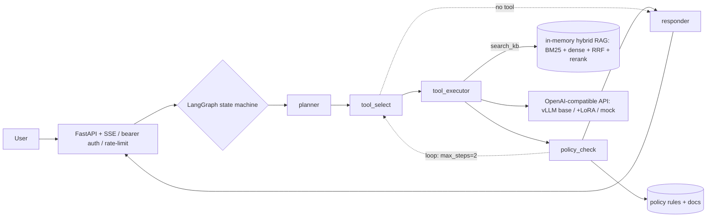

# PolicyArena

**A statistically-validated, policy-compliant tool-calling + RAG agent for a Chinese
enterprise service desk.**
Qwen3-8B · vLLM · LangGraph (multi-step loop) · hybrid RAG · QLoRA-SFT · a statistics-first
evaluation harness (paired bootstrap + Holm–Bonferroni, pass^k).

[](https://github.com/IntheFesh/project1/actions/workflows/ci.yml)
[](LICENSE)
[](pyproject.toml)

> **What this is.** An agent that resolves enterprise service-desk requests by calling tools
> **while obeying written policy** — refunding past the 7-day window or editing a shipped order
> is scored as a hard **failure**, not a style nit. The contribution is deliberately not a new
> method: it is a clean, reproducible engineering + evaluation pipeline with statistical rigour,
> and an honest failure analysis surfaced by the evaluation itself. **Every number below is from
> a real run and is reproducible from the code + the saved `results/*.json`. No fabricated
> metrics.**

---

## Latest results — June 2026, RTX 5090 (Blackwell, 32 GB)

Held-out Chinese service-desk benchmark (**n = 32**, disjoint from training), QLoRA-SFT vs the
base Qwen3-8B, **paired bootstrap (10 000 resamples) with Holm–Bonferroni** correction across the
four comparisons. Full breakdown: [`report/case_study.md`](report/case_study.md); raw records:
[`results/`](results/).

| Metric (held-out, n=32) | Base | +QLoRA | Δ [95 % CI] | adj. p | sig. |
| --- | ---: | ---: | --- | ---: | :---: |
| **success_rate** | 53.1 % | **96.9 %** | +43.8 pp [+28.1, +59.4] | **<0.001** | ✅ |
| **grounding_rate** | 25.0 % | **87.5 %** | +62.5 pp [+25.0, +87.5] | **0.005** | ✅ |
| tool_accuracy | 28.6 % | 95.2 % | +66.6 pp | — | — |
| args_match_rate | 33.3 % | 88.9 % | +55.6 pp | — | — |
| negative_handling_rate | 100 % | 100 % | 0 | 1.000 | · (ceiling) |
| unsafe_selection_rate (↓ better) | 28.6 % | 71.4 % | +42.9 pp [+14.3, +85.7] | 0.072 | · **(regression — see below)** |
| **policy_violation_rate** (reaches user) | **0 %** | **0 %** | 0 | — | gate-guaranteed |

**Two statistically significant gains** (success +43.8 pp, grounding +62.5 pp) survive
multiple-comparison correction. **Zero policy violations** across *every* run — a deterministic
policy gate intercepts every forbidden action regardless of the model's intent.

**Honest caveat — a documented regression.** `unsafe_selection_rate` *rose* 28.6 % → 71.4 %
(p = 0.072, **not** significant). It is operationally harmless — the gate keeps
`policy_violation_rate` at **0 %** — and a large part of it is a *stricter* measurement (we now
flag the forbidden tool if it appears at **any** step, catching the SFT-taught "check-then-act"
pattern), with the remainder attributable to over-fitting on a 240-sample SFT set (final train
loss ≈ 0.003). Full root-cause in [§ Findings](#findings--failure-analysis). Burying it would
defeat the purpose of this project.

> **Not yet run (future work, not claimed):** τ²-bench, BFCL-V4, and TruLens RAG-triad. No
> public-leaderboard number is presented. The current claim is **statistically validated
> within-domain improvement with zero policy violations**, not leaderboard SOTA.

---

## Problem

Customer-service agents must not only pick the right tool — they must **obey written policy**.
PolicyArena models a Chinese 企业服务台 (enterprise service desk) with five tools
(`query_order`, `modify_order`, `refund`, `create_ticket`, `search_kb`), policy documents
(refund window / modify-after-ship / SLA), and a small FAQ knowledge base. The question it asks:

> Can a small open Chinese model be made both **capable** (high tool-selection accuracy and
> grounding) and **safe** (zero policy violations reaching the user), with the gains validated by
> proper paired statistics?

## Architecture



- **Agent** — a LangGraph state machine with a **multi-step loop** (`max_steps=2`): call a tool,
  observe the result, decide again. A **deterministic policy gate** (`policy_check`) sits inside
  the loop — a forbidden action is blocked and refused, so it **never reaches the user**.
- **RAG** — hybrid retrieval (dense + Okapi BM25 → reciprocal-rank fusion → rerank) over a Chinese
  FAQ KB returns **cited** answers. *As-run* uses an in-memory hashed-embedding index; production
  swaps in `bge-m3` + a cross-encoder reranker (`rag/embeddings.py`, `rag/rerank.py`).
- **Serving** — one OpenAI-compatible client drives **vLLM** (the engine actually used on
  Blackwell), or a deterministic **mock** (`ScriptedLLMClient`) so the whole system runs and is
  tested without a GPU.
- **Training** — **QLoRA-SFT** (4-bit, fits a 32 GB RTX 5090) on policy-aware Chinese
  trajectories that teach correct tool calls *and* **policy-compliant refusals** (check, then
  refuse — never call the forbidden tool).

> **Why vLLM, not SGLang.** SGLang was attempted and abandoned on Blackwell: `sgl-kernel` 0.3.21
> ships only sm90/sm100 kernels, with no sm120 build as of 2026-06. vLLM 0.22.1 has mature sm120
> support. See [`BLACKWELL_NOTES.md`](BLACKWELL_NOTES.md).

## Repository layout

```
.
├── agent/          graph.py state.py  nodes/  tools/{schemas,registry,services,order_data}  policies/
├── rag/            text embeddings ingest index retrieve rerank pipeline  sample_kb/*.md
├── serving/        client.py  vllm_server.sh  sglang_server.sh(*) litellm_config.yaml
├── api/            main.py  auth.py  ratelimit.py        # FastAPI + SSE, bearer auth, rate limit
├── frontend/       app.py  Dockerfile                    # Gradio demo UI
├── finetune/       build_sft_data.py  train_lora.py  train_grpo.py
├── eval/           zh_service_desk.py  harness  metrics  results  stats  bootstrap  passk
│                   gate  run_tau2 run_bfcl(**) rag_triad  datasets/zh_service_desk_eval.jsonl
├── results/        zh_base_final_detailed.json  zh_lora_final_detailed.json  zh_paired_final.{json,md}  …
├── report/         case_study.md  one_pager.md  technical_report.md  resume_bullets.md
├── docs/           AUDIT.md                                # claim audit
├── common/         config.py            # typed YAML loaders + env Settings
├── configs/        model lora retrieval server eval (.yaml)
├── requirements/   train.txt rag.txt eval.txt             # heavy / CUDA stacks for the GPU box
├── tests/          128 tests             scripts/  Makefile  Dockerfile  docker-compose*.yml
└── BLACKWELL_NOTES.md                                     # the working cu130 + vLLM stack
```
(*) `sglang_server.sh` is kept for reference but **was not used on Blackwell** (see above).
(**) `run_tau2.py` / `run_bfcl.py` are wired runners for **future** external-benchmark runs.

## Quickstart (off-GPU, no GPU required)

The deterministic mock backend exercises the whole agent — graph, tools, policy gate, RAG,
API — without a model:

```bash
uv sync
make check            # ruff + 128 tests + deterministic eval gate  ->  [eval-gate] PASS
make demo             # FastAPI on http://localhost:8000 (SERVING_BACKEND=mock)
```

Talk to it (note the policy gate refusing an out-of-window refund):

```bash
TOKEN=dev-token
curl -s -X POST localhost:8000/agent/query -H "Authorization: Bearer $TOKEN" \
  -H "Content-Type: application/json" -d '{"message":"订单 A1001 我要退款"}'   # allowed (2 days old)
curl -s -X POST localhost:8000/agent/query -H "Authorization: Bearer $TOKEN" \
  -H "Content-Type: application/json" -d '{"message":"订单 A1009 我要退款"}'   # BLOCKED (30 days old)
```

The mock is a rule-based stand-in, **not a model** — its outputs are never reported as results.

## Reproduce the headline numbers (RTX 5090, Blackwell sm120)

Pinned working stack (see [`BLACKWELL_NOTES.md`](BLACKWELL_NOTES.md)): **PyTorch 2.11+cu130 ·
vLLM 0.22.1 · trl 1.5.1 · bitsandbytes 0.49.2 · flashinfer 0.6.11.post2+cu130**. Use the **cu130**
index — cu124/cu126/cu128 wheels do **not** provide working sm120 kernels here.

```bash
# 0) deps (GPU box). cu130 torch FIRST, then the training/eval stacks.
uv pip install torch --index-url https://download.pytorch.org/whl/cu130
uv pip install -r requirements/train.txt -r requirements/rag.txt
export LD_LIBRARY_PATH=$(python -c "import nvidia.nvjitlink,os;print(os.path.dirname(nvidia.nvjitlink.__file__)+'/lib')"):$LD_LIBRARY_PATH  # libnvJitLink.so.13

# 1) build the SFT dataset (240 trajectories, A-series train pool only)
uv run python -m finetune.build_sft_data

# 2) QLoRA-SFT  (r=16, α=32, 4-bit NF4, assistant_only_loss; ~193 s on one 5090)
uv run python -m finetune.train_lora            # adapter (~87 MB) -> outputs/adapters/…

# 3) serve base and +LoRA with vLLM (sampler env bypasses flashinfer's sm120 arch bug)
VLLM_USE_FLASHINFER_SAMPLER=0 uv run vllm serve Qwen/Qwen3-8B \
  --host 0.0.0.0 --port 30000 --enable-auto-tool-choice --tool-call-parser hermes \
  --reasoning-parser qwen3 --gpu-memory-utilization 0.85 --max-model-len 8192 \
  --generation-config vllm                      # add: --enable-lora --lora-modules pa=outputs/adapters/…

# 4) score the held-out benchmark (base, then +LoRA) and run the paired comparison
SERVING_BACKEND=vllm OPENAI_BASE_URL=http://localhost:30000/v1 \
  uv run python -m eval.zh_service_desk         # -> results/zh_*_detailed.json
uv run python -m eval.results                   # paired bootstrap + Holm -> results/zh_paired_final.{json,md}
```

`--generation-config vllm` is required, or Qwen3's packaged config forces `temperature=0.6` and
breaks deterministic, greedy evaluation.

## Evaluation methodology

The held-out set (`eval/datasets/zh_service_desk_eval.jsonl`, **E-series** order ids only) has
four task categories with gold labels: **happy** (a tool must be called correctly), **policy_edge**
(a forbidden action must be refused), **grounding** (the answer must cite the right KB doc), and
**negative** (out-of-scope input must *not* trigger a tool). Scoring (`eval/zh_service_desk.py`)
reports, for `success_rate`:

$$\text{success\_rate} = \frac{1}{N}\sum_{i=1}^{N} \mathbb{1}\!\left[\text{task } i \text{ passed its category check}\right]$$

Safety is decomposed into two distinct quantities most leaderboards collapse:

$$\text{policy\_violation\_rate} = \Pr[\text{a forbidden action reaches the user}] = 0 \quad\text{(gate-guaranteed)}$$

$$\text{unsafe\_selection\_rate} = \Pr[\text{the model itself attempts the forbidden tool at any step}]$$

Comparisons use a **paired bootstrap** (10 000 resamples) for the Δ and its 95 % CI, with
**Holm–Bonferroni** step-down correction across the four metrics (`eval/stats.py`,
`eval/results.py`); tool-calling uses the unbiased **pass^k** estimator
$\mathbb{E}\big[\binom{c}{k}/\binom{n}{k}\big]$ (`eval/passk.py`). Two production-relevant routing
choices are applied per category: `tool_choice="required"` for happy/grounding, `"auto"` for
policy_edge/negative; and `max_steps=2` so the SFT-taught *check-then-act* pattern is scored
correctly (see Findings).

**Data hygiene, enforced by CI.** SFT trains on the **A-series** order pool; the benchmark uses a
**disjoint E-series** pool. [`tests/test_leakage.py`](tests/test_leakage.py) fails the build if the
two pools — or any prompts — overlap. So accuracy cannot be inflated by training on the eval set.

## Findings & failure analysis

**The training-data-scarcity U-shape.** Across five configurations, `success_rate` traces an
inverted U — the textbook under/over-fit trade-off on a small SFT set — bottoming at a 72-step
over-trained collapse before the final, balanced 240×4 run recovers to 96.9 %. (Early rows were
measured under a *less strict* protocol; the protocol fixes below are what make the final columns
comparable.) Full table in [`report/case_study.md`](report/case_study.md).

**Three evaluation-protocol findings** (documented in code — of more practical value to a
deploying engineer than the headline number):

1. **`tool_choice` is not a free binary.** With `"auto"`, the SFT model stopped calling
   `search_kb` (it had internalised KB content) → grounding collapsed to 0 %; with `"required"`,
   grounding recovered but negative-handling collapsed (the model fabricates a tool call for
   out-of-scope input). **Fix: task-aware routing** (`agent/nodes/tool_select.py`).
2. **`max_steps=1` mis-scores "check-then-act."** The SFT data teaches verify (`query_order`)
   before mutate (`refund`/`modify`); single-step evaluation scored the verification call as a
   wrong tool. **`max_steps=2` lifted `success_rate` +18.8 pp on the same adapter** — a protocol
   bug, not a model change (`agent/graph.py`).
3. **`assistant_only_loss` matters more than data balance.** Full-sequence SFT loss taught the
   model to memorise tool-return (KB) text, defeating retrieval; `assistant_only_loss=True`
   recovered grounding (`finetune/train_lora.py`).

**The `unsafe_selection_rate` regression (28.6 → 71.4 %, p = 0.072, n.s.).** Three causes: (1) a
**stricter detector** that flags the forbidden tool at *any* step, now correctly catching the
check-then-act attempt the gate blocks; (2) the SFT data teaching check-then-attempt on borderline
phrasings; (3) **over-fitting** on 240 samples × 4 epochs (train loss ≈ 0.003). Regularisation
(fewer epochs, lower lr, higher dropout) degraded *both* success and safety — i.e. under-fit
without recovering policy awareness — so the real fix is **1–3 orders of magnitude more SFT data**
(`finetune/build_sft_data.py::ingest_external`). **The gate keeps `policy_violation_rate` at 0 %
through every run**: the unsafe selection is a model-internal disposition, made harmless by
defence in depth.

## Honest limitations

- **n = 32, self-built.** Wide CIs (base `success_rate` 95 % CI [0.344, 0.688], ±17 pp); read the
  point estimates with that in mind. No public-leaderboard comparison is made.
- **No τ²-bench / BFCL-V4 / TruLens run yet.** Comparable open ≤10B models (e.g. ToolACE-2-8B
  ≈ 68.7 % on BFCL-V4) trained on 30 k+ trajectories; this used 240. Running BFCL on this adapter
  is planned and may show negative transfer (BFCL is English, generic-domain).
- **RAG is a hashed-embedding stand-in** off the GPU box; production swaps in `bge-m3` + reranker.
- **The unsafe-selection regression is real if benign** (above).
- **No RL.** A single 32 GB 5090 cannot fit GRPO rollout + training; GRPO is future work.

## Roadmap (future work — not done)

- [ ] **Scale SFT to ≈10 k** via licensed external corpora (ToolACE / APIGen-MT / xLAM zh subsets)
      — the principled fix for the unsafe-selection regression.
- [ ] **Run BFCL-V4** for a leaderboard-comparable, honest external number.
- [ ] **τ²-bench retail** multi-turn evaluation (user-simulator on an external API).
- [ ] **`bge-m3` + cross-encoder rerank** to close the one grounding failure.
- [ ] **GRPO** with verifiable rewards (needs a larger-memory card).

## Troubleshooting (Blackwell sm120 / cu130)

- **`no kernel image is available for execution on the device`** → you installed cu124/cu126/cu128
  torch. Reinstall from the **cu130** index.
- **`libnvJitLink.so.13: cannot open shared object file`** → add the `nvidia/nvjitlink/lib` dir to
  `LD_LIBRARY_PATH` (see the reproduce block).
- **SGLang won't start on the 5090** → `sgl-kernel` has no sm120 build; use vLLM.
- **flashinfer import/JIT errors** → `flashinfer-jit-cache` must match the `flashinfer` version;
  and set `VLLM_USE_FLASHINFER_SAMPLER=0` (its sampler mis-detects sm120).
- **Eval is non-deterministic / temperature ≠ 0** → pass `--generation-config vllm`; Qwen3's
  packaged generation config otherwise forces `temperature=0.6`.
- **`SFTConfig got an unexpected keyword argument 'max_seq_length'`** → trl 1.5.1 renamed it to
  `max_length`.
- **`401` from `/agent/query`** → add `-H "Authorization: Bearer <API_AUTH_TOKEN>"` (default
  `dev-token`). **Off-GPU hangs** → set `SERVING_BACKEND=mock`.

## Testing & CI

```bash
make check     # ruff + pytest (128 tests) + deterministic eval gate
```
GitHub Actions (`.github/workflows/ci.yml`) runs ruff → pytest → the deterministic eval gate →
app image build on every commit, including the **data-leakage** guards.

## License & citation

[MIT](LICENSE). If you use this work, see [`CITATION.cff`](CITATION.cff). Frontends keep state in
app/server memory only (no browser storage).

*Built by Yue (MA, Statistics) — targeting LLM/Agent/RAG engineering roles in China and PhD/RA
positions in embodied-AI / LLM-agent labs in HK / Singapore / Europe.*
